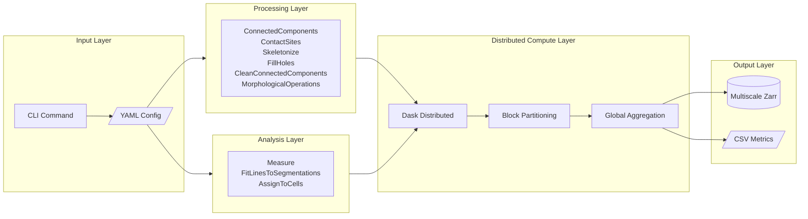
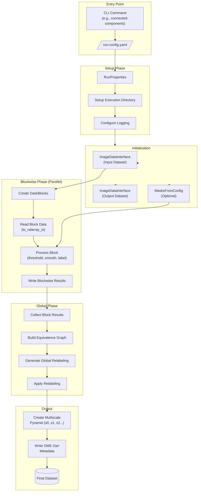
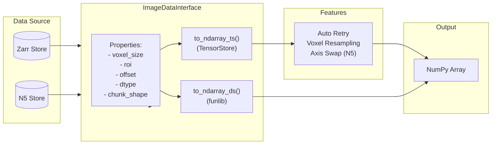
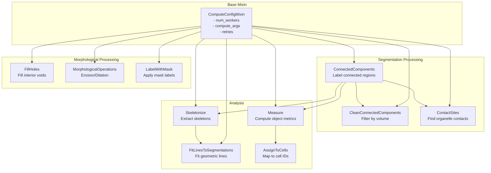
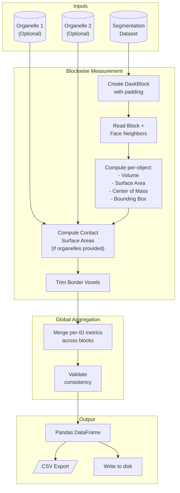
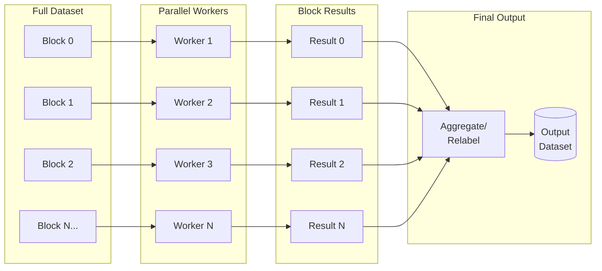
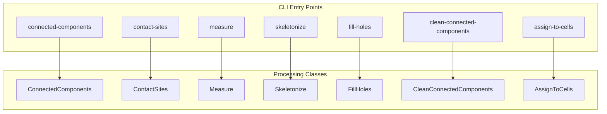

# cellmap-analyze Architecture Flowchart

## High-Level Overview

## Detailed Processing Pipeline

## Data Flow Through ImageDataInterface

## Processing Classes Relationships

## Measure Analysis Flow

## Dask Block Processing Pattern

## CLI Commands Overview

---

## How to View These Diagrams

1. **GitHub**: Copy the mermaid code blocks into any GitHub markdown file - GitHub renders Mermaid natively

2. **Mermaid Live Editor**: Paste into https://mermaid.live/

3. **VS Code**: Install "Markdown Preview Mermaid Support" extension

4. **Documentation Sites**: Most modern doc generators (MkDocs, Docusaurus, etc.) support Mermaid
